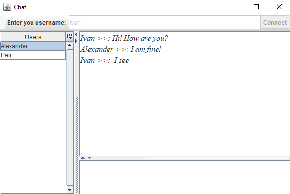

# Simple chat application

- Backend: PostgreSQL
- ORM: Hibernate
- GUI: Java Swing, Swingx
- DI: Dagger 2
- Pub/sub: pgjdbc-ng
- Tests: JUnit/H2

## Table of contents

- [Build and run](#Build-and-run)
- [License](#license)
- [Contact](#contact)

## Build and run
- Log in to PostgreSQL and create schema objects `postgres=# \i ./schema.sql`
- Set your database connection properties [here](https://github.com/akardapolov/chat/blob/master/src/main/resources/hibernate.cfg.xml)
- Run `mvn package` from IntelliJ IDEA
- Start application: target/chat-1.0-SNAPSHOT-jar-with-dependencies.jar

## License

  Code released under the GNU General Public License v3.0
  
## Contact
  Created by [@akardapolov](mailto:akardapolov@gmail.com)